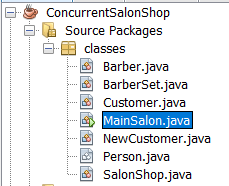

## Prerequisites
- JDK 1.8
- Netbeans 8.2

## The Salon Shop problem
  

There are 3 barbers work independently in a salon shop:
- The salon has 3 salon chairs, each of which is assigned to one barber.
- Due to budget restrictions, there are only 2 combs and 2 scissors in the salon.
- There are 10 chairs in the sitting area and 10 spaces in the standing area.

Each barber follows the same work plan:
- The barber sleeps when no customer is waiting (and is not in the barber's own chair).
- When the barber is asleep, the barber waits to be awakened by a new customer.
- Once awake, the barber cuts the hair of a customer in the barber's chair.
- The barber requires a comb and a pair of scissors to cut a customer’s hair. When the haircut is done, the customer pays the barber and then is free to leave.
- After receiving payment, the barber calls the next waiting customer (if any). If such a customer exists, that customer sits in the barber's chair and the barber starts the next haircut. If no customer is waiting, the barber goes back to sleep.

Each customer follows the following sequence of events:
- When the customer first enters the salon, the customer leaves immediately if more than 20 people are waiting (10 standing and 10 sitting). On the other hand, if the salon is not too full, the customer enters and waits.
-	If at least one barber is sleeping, the customer wakes up the barber who is sleeping, and sits in that barber’s chair (after the barber has stood up).
-	If all barbers are busy, the customer sits in a waiting-room chair, if one is available. Otherwise, the customer remains standing until a waiting-room chair becomes available.
-	Customers keep track of their order, so the person sitting the longest is always the next customer to get a haircut.
-	Similarly, standing customers remember their order, so the person standing the longest takes the next available waiting-room seat.

### Requirements
This Salon Shop is implemented in Java Netbeans using concurrent programming concepts. **Must not** kill a thread or process using any of the following primitives in Java:
-	Thread.stop 
-	Thread.resume 
-	Thread.suspend 
-	Thread.interrupt 
-	setDaemon 
- May not use the destroy or stop(0) primitives in - except to take care of temporary resources like simple timers. 

## Run Concurrent Salon Shop System
`main()` is in `MainSalon.java`. Run `MainSalon.java` to simulate concurrent Salon Shop System

  

At `MainSalon.java` line 5: the `runTime` of the system is set to 45 seconds. Can change `runTime` value.

### Scenarios to check the Concurrent Salon Shop System
Scenario #1: There are few customers, the barbers sleep most of the time:
```
At line 31 in `NewCustomer.java`, increate the integer value of `rand.nextInt()` to >= 30.
```
- The barber is provided to customer fairly: the barber with the longest waiting (sleeping time) will serve a new customer first. Every barber takes turn to serve a new customer.
-	The barber set is used fairly, each set is taken turn to be used by a barber
-	The barbers close the shop when it is time to close.

Scenario #2: There are many customers, some customers leave because the shop is full at 20 waiting customers:
```
At line 31 in `NewCustomer.java`, set the integer value of `rand.nextInt()` to 1.
At line 110 in `SalonShop.java`, set the integer value of `rand.nextInt()` to >= 5
```
-	New customers declare to stand in waiting area if the sitting area is full.
-	Standing customers sit on waiting chairs whenever there are free chairs.
-	New customers declare to leave when the shop is full.
-	When no new customers come the shop, the barbers still cut hair for customers in waiting area until there is no customer left. Then the shop is closed.
